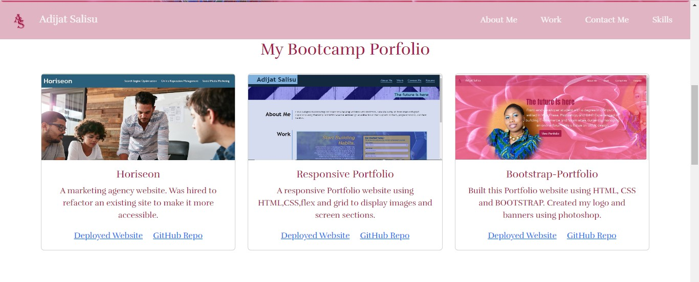
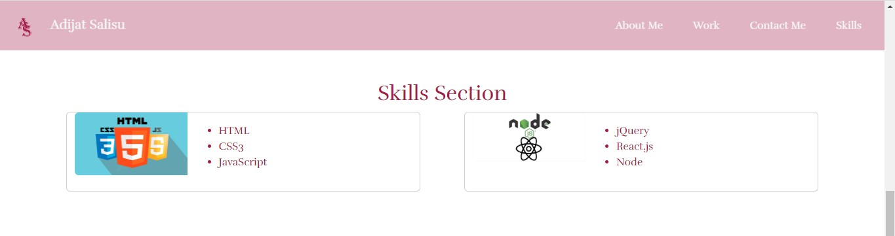
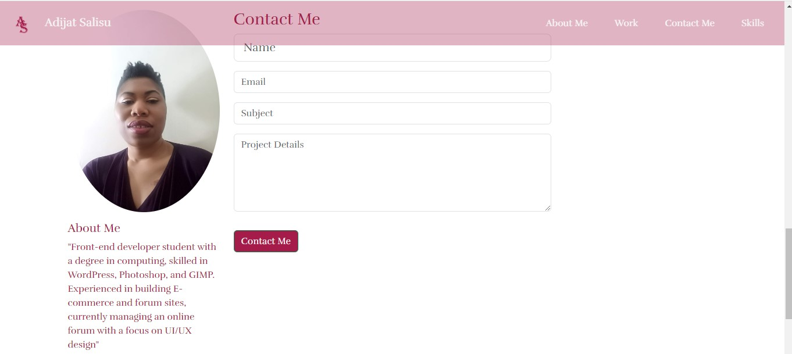
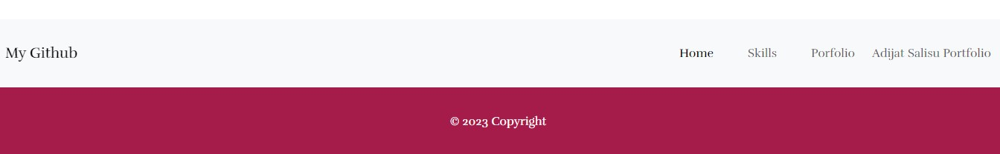

# Bootstrap-Portfolio

<!-- PROJECT LOGO -->
 

  

<h3 align="center">Adijat Salisu Bootstrap Portfolio</h3>

  

    This is my portfolio web page, built this portfolio layout using the Bootstrap CSS Framework. 
     
    <a href="https://github.com/addy306/Bootstrap-Portfolio"><strong>GitHub repository</strong></a>
     
    <a href="https://github.com/addy306/Bootstrap-Portfolio"><strong>Deployed Website</strong></a>
     
     
    
  

<!-- ABOUT THE PROJECT -->
## About The Project

This is my student front end developer webpage with various sections. It showcases my bootcamp portfolio, my skills, about me section, contact me section and a footer with Nav bar.See below 

### Built With

* Bootstrap
* HTML
* CSS

## Webpage Features

### Navbar and Banner

### Portfolio Section

### Skill Section

### About Me & Contact Me

### Footer

# Checkout my other projects

* [Responsive Webpage](https://addy306.github.io/responsive-portfolio-website/)
 * [Horiseon Webpage](https://addy306.github.io/module1-challange/)

<!-- LICENSE -->
## License

Distributed under the MIT License. See `LICENSE.txt` for more information.

Project Link: [https://github.com/addy306/Bootstrap-Portfolio](https://github.com/addy306/Bootstrap-Portfolio)

## Helpful Resources

- [Bootstrap Documentation](https://getbootstrap.com/docs/5.3/getting-started/introduction/)

- [Responsive Web Design - How to Create Media Queries](https://www.youtube.com/watch?v=5xzaGSYd7jM)

- [Media Queries 101 by CSS Tricks](https://css-tricks.com/css-media-queries/)

- [Media Query Documentation](https://www.w3schools.com/css/css_rwd_mediaqueries.asp)

- [Github Pages Guide](https://pages.github.com/)

